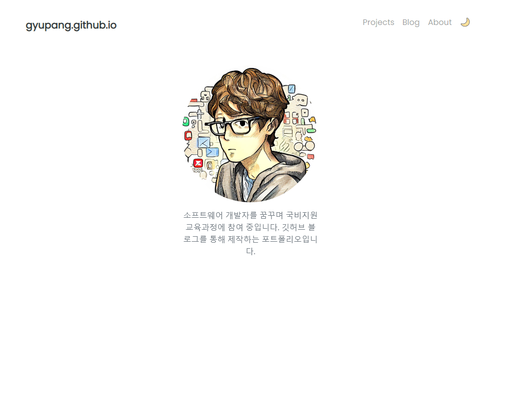

# Portfolio

---

환영합니다!

## Features
Github.io를 이용하여 개인적인 포트폴리오와 웹사이트를 만들었습니다.
포트폴리오 페이지와 블로그 기능을 사용할수 있습니다.

### [Portfolio Homepage](https://gyupang.github.io/projects/)

포트폴리오 페이지
<!-- 
### [Presentations List]()

A optional list of your presentations auto-generated for a data file. -->

### [Blog](https://gyupang.github.io/blog/)

블로그

<!-- ## Licence

The theme is available as open source under the terms of the [MIT Licence](https://opensource.org/licenses/MIT). -->

<!-- https://youssefraafatnasry.github.io/portfolYOU/docs/ -->